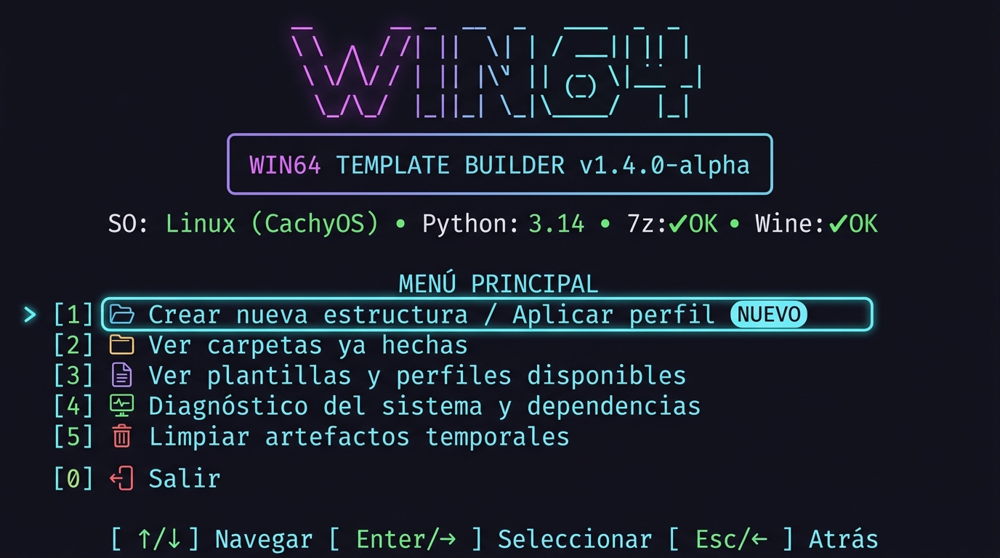

# ✦ Win64 Template Builder

<div align="center">



**Win64 Template Builder** es una herramienta CLI y TUI multiplataforma moderna (Linux / Windows / Wine) diseñada para generar y administrar estructuras de carpetas y recetas de perfiles a partir de plantillas base inmutables (`Win64.rar`).

[](https://www.python.org/downloads/)
[](#)
[](#-ejecución-de-pruebas-automatizadas)
[](#)

</div>

---

## 📋 Requisitos e Instalación

La herramienta utiliza **únicamente la biblioteca estándar de Python** en producción. Solo requiere una versión reciente de Python y un extractor de archivos RAR (como 7-Zip).

### 1. Entorno de Ejecución Python
* **Python >= 3.11** instalado en el sistema.

---

### 2. Instalación de Extractor RAR (7-Zip)

Para extraer y verificar la plantilla base `Win64.rar`, el sistema debe contar con `7z` o `unrar`:

#### 🐧 Linux:
* **Arch Linux / CachyOS / Manjaro**:
  ```bash
  sudo pacman -S 7zip
  ```
* **Ubuntu / Debian / Linux Mint**:
  ```bash
  sudo apt update && sudo apt install -y 7zip
  # o alternativamente: sudo apt install -y unrar
  ```
* **Fedora / RHEL**:
  ```bash
  sudo dnf install -y p7zip p7zip-plugins
  ```

#### 🪟 Windows:
* **Vía Winget (PowerShell / CMD)**:
  ```powershell
  winget install 7zip.7zip
  ```
* **Instalador oficial**: Descargar e instalar desde [https://www.7-zip.org/](https://www.7-zip.org/). El script detectará automáticamente la ruta `C:\Program Files\7-Zip\7z.exe` incluso si no está en el `%PATH%`.

---

### 3. Configuración de Wine (Solo para usuarios de Linux)

Si ejecutas en Linux y deseas correr los ejecutables de Windows (`.exe`) generados:

#### Paquetes del Sistema:
* **Arch Linux / CachyOS**:
  ```bash
  sudo pacman -S wine winetricks wine-gecko wine-mono vulkan-icd-loader lib32-vulkan-icd-loader lib32-gnutls
  ```
* **Ubuntu / Debian**:
  ```bash
  sudo apt install -y wine winetricks wine-gecko wine-mono
  ```
* **Fedora**:
  ```bash
  sudo dnf install -y wine winetricks
  ```

#### Preparación del prefijo Wine (Opcional pero recomendado):
Para inicializar el prefijo de 64 bits y evitar avisos continuos:
```bash
WINEPREFIX=~/.wine WINEARCH=win64 wineboot -u
winetricks corefonts vcrun2015 d3dcompiler_47
```

---

### 4. Entorno de Desarrollo y Pruebas (Opcional)

Para ejecutar la suite de pruebas unitarias:
```bash
# Crear entorno virtual e instalar dependencias de desarrollo
python3 -m venv .venv
source .venv/bin/activate   # En Windows: .venv\Scripts\activate
pip install -r requirements-dev.txt
```

---

## 🚀 Guía de Uso

### 1. Menú Principal Interactivo TUI (Predeterminado)

Ejecute el programa en su terminal sin argumentos:

```bash
python3 main.py
```

#### 🎮 Controles de Navegación por Teclado:
* **`↑` / `↓`** (o `W` / `S` / `K` / `J`): Moverse fluidamente entre las opciones con resaltado neón.
* **`Enter` / `→`** (o `Espacio` / `D` / `L`): Seleccionar y avanzar.
* **`Esc` / `←`** (o `Q` / `A` / `H` / `Backspace`): Volver al menú anterior o salir.
* **`0` - `5`**: Teclas de acceso directo numérico instantáneo.

```text
  ██╗    ██╗██╗███╗   ██╗ ██████╗ ██╗  ██╗
  ██║    ██║██║████╗  ██║██╔════╝ ██║  ██║
  ██║ █╗ ██║██║██╔██╗ ██║███████╗ ███████║
  ██║███╗██║██║██║╚██╗██║██╔═══██╗╚════██║
  ╚███╔███╔╝██║██║ ╚████║╚██████╔╝     ██║
   ╚══╝╚══╝ ╚═╝╚═╝  ╚═══╝ ╚═════╝      ╚═╝

  ╭───────────────────────────────────────────────────────────────╮
  │  ✦ WIN64 TEMPLATE BUILDER                      v1.4.0-alpha │
  │  Cross-Platform Profile Recipe & Multi-Artifact Generator    │
  ╰───────────────────────────────────────────────────────────────╯

  󰌽 SO: Linux (CachyOS)  •  󰌠 Python: 3.14.7  •  📦 7z: 7z: OK  •  🍷 Wine: Wine: OK

  ─── ◈ MENÚ PRINCIPAL ──────────────────────────────────────────

  ➜  [ 1 ]  🚀 Crear nueva estructura / Aplicar perfil ✦
     [ 2 ]  📁 Ver carpetas ya hechas (explorar, renombrar exe, ejecutar)
     [ 3 ]  📋 Ver plantillas y perfiles disponibles
     [ 4 ]  🩺 Diagnóstico del sistema y dependencias (Linux / Windows)
     [ 5 ]  🧹 Limpiar artefactos temporales
     [ 0 ]  🚪 Salir

  ────────────────────────────────────────────────────────────────
  [ ↑/↓ ] Navegar   [ Enter/→ ] Seleccionar   [ Esc/← ] Atrás   [ 0-5 ] Atajos
```

---

### 2. Diagnóstico del Sistema y Requisitos (`doctor`)

Ejecuta un análisis exhaustivo del sistema detectando distribución Linux, kernel, runtime de Python, extractores disponibles y estado de Wine/Winetricks:

```bash
python3 main.py doctor
```

```text
╭────────────────────────────────────────────────────────╮
│ Diagnóstico del Sistema y Requisitos                   │
╰────────────────────────────────────────────────────────╯

Sistema Operativo: CachyOS Linux | Kernel 6.13.0-cachyos (x86_64)
Versión de Python: 3.14.7

Resultados del Diagnóstico:
  [✓ OK] Entorno Python: Python 3.14.7 (Compatible >= 3.11)
  [✓ OK] Extractor RAR: 7z encontrado en '/usr/bin/7z'
  [✓ OK] Wine Runner: Wine detectado en '/usr/bin/wine'
  [✓ OK] Winetricks: Winetricks detectado en '/usr/bin/winetricks'
  [✓ OK] Plantilla Base: 'Win64.rar' válida (1 exe, 1 dlls, 2 idiomas)

✓ ¡Excelente! Todas las dependencias y herramientas están listas y configuradas.
```

---

### 3. Explorar y Gestionar Carpetas Creadas (`--list-folders`)

Permite ver rápidamente todas las carpetas generadas con sus estructuras y ejecutables:

```bash
python3 main.py --list-folders
```

Desde el menú interactivo (Opción `[2]`), puedes seleccionar cualquier carpeta para:
1. **▶️ Ejecutar la aplicación** (mediante Wine en Linux o de forma nativa en Windows).
2. **✏️ Renombrar el ejecutable `.exe`** conservando la estructura de archivos existente.

---

### 4. Inspección de Plantilla Base (`inspect`)

Verifica la integridad, hashes SHA-256, ejecutables candidatos y la estructura interna del archivo `Win64.rar` sin tocar el disco:

```bash
python3 main.py inspect
```

---

### 5. Modo Simulación (`--dry-run`)

Muestra una vista previa detallada del plan de construcción y árbol de directorios que se crearía:

```bash
python3 main.py --folder "My Game" --exe "MyGame.exe" --layout direct --dry-run
```

---

### 6. Automatización CLI (Modo No Interactivo / Headless)

Para scripts o pipelines automáticos, pasa todos los argumentos directamente por línea de comandos:

#### Layout Directo con Ejecución en Wine / Nativo (`--wine`):
```bash
python3 main.py \
  --folder "Shift At Midnight Demo" \
  --exe "Shift At Midnight.exe" \
  --layout direct \
  --output "./output" \
  --wine
```

#### Layout Estructura Steam:
```bash
python3 main.py \
  --folder "Marvel Tokon" \
  --exe "Game.exe" \
  --layout steam \
  --output "./output"
```

#### Layout Steam apuntando a una biblioteca externa (`--steam-library`):
```bash
python3 main.py \
  --folder "Tokon Game" \
  --exe "Game.exe" \
  --layout steam \
  --steam-library "/mnt/games/SteamLibrary"
```

#### Layout Personalizado:
```bash
python3 main.py \
  --folder "Custom Game" \
  --exe "Game.exe" \
  --layout custom \
  --custom-path "steamapps/common/MyGame/Binaries/Win64"
```

---

### 7. Limpieza de Artefactos Temporales (`clean`)

Elimina de forma segura artefactos temporales creados por fallos o staging incompleto (`.win64-builder-*`):

```bash
python3 main.py clean
```

---

## 🧪 Ejecución de Pruebas Automatizadas

El proyecto cuenta con **73 pruebas automatizadas** de cobertura integral (`pytest`):

```bash
# Ejecutar todas las pruebas con salida detallada
.venv/bin/pytest -v
```

```text
============================== 73 passed in 0.63s ==============================
```

---

## 🛡️ Reglas de Seguridad y Compatibilidad Cross-Platform

- **Inmutabilidad de Plantilla**: `Win64.rar` nunca se modifica en disco; se valida su hash antes y después de cada operación.
- **Transaccionalidad Sibling**: El staging temporal (`.destination.build-<uuid>`) se crea en el mismo sistema de archivos padre para prevenir fallos `EXDEV` entre particiones distintas (ext4, Btrfs, NTFS, exFAT).
- **Rollback Transaccional**: En caso de error o interrupción, se restaura el estado previo del directorio sin dejar archivos corruptos.
- **Protección contra Zip/Rar Slip**: Se bloquean entradas con rutas absolutas, secuencias `..`, caracteres UNC o enlaces simbólicos maliciosos.
- **Validaciones NTFS / Windows**: Se filtran caracteres prohibidos (`< > : " / \ | ? *`), nombres con punto o espacio final (`"Game."`), y nombres de dispositivo reservados en Windows (`CON`, `PRN`, `AUX`, `NUL`, `COM1-9`, `LPT1-9`) independientemente de la extensión.

